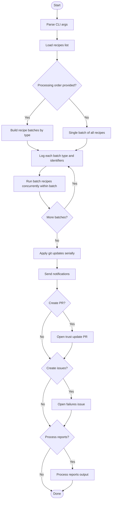

# autopkg-wrapper

`autopkg_wrapper` is a small package that can be used to run [`autopkg`](https://github.com/autopkg/autopkg) within CI/CD environments such as GitHub Actions.

The easiest way to run it is by installing with pip.

```shell
pip install autopkg-wrapper
```

## Development

This project uses `uv` for dependency management and `mise` tasks for common workflows.

```bash
mise run install
mise run test
mise run build
```

## Command Line Parameters

<!-- CLI-PARAMS-START -->

```shell
usage: autopkg_wrapper [-h] [--recipe-file RECIPE_FILE |
                       --recipes [RECIPES ...]]
                       [--recipe-processing-order [RECIPE_PROCESSING_ORDER ...]]
                       [--autopkg-bin AUTOPKG_BIN] [--dry-run] [--debug]
                       [--disable-recipe-trust-check] [--disable-git-commands]
                       [--concurrency CONCURRENCY]
                       [--github-token GITHUB_TOKEN]
                       [--branch-name BRANCH_NAME] [--create-pr]
                       [--create-issues]
                       [--overrides-repo-path OVERRIDES_REPO_PATH]
                       [--post-processors [POST_PROCESSORS ...]]
                       [--autopkg-prefs AUTOPKG_PREFS] [--process-reports]
                       [--reports-zip REPORTS_ZIP]
                       [--reports-extract-dir REPORTS_EXTRACT_DIR]
                       [--reports-dir REPORTS_DIR]
                       [--reports-out-dir REPORTS_OUT_DIR]
                       [--reports-run-date REPORTS_RUN_DATE]
                       [--reports-strict]

Run autopkg recipes

options:
  -h, --help            show this help message and exit
  --recipe-file RECIPE_FILE
                        Provide the list of recipes to run via a JSON file for
                        easier management.
  --recipes [RECIPES ...]
                        Recipes to run via CLI flag or environment variable.
                        If the '--recipes' flag is used, simply provide a
                        space-separated list on the command line: `autopkg-
                        wrapper --recipes recipe_one.download
                        recipe_two.download` Alternatively, you can provide a
                        space/comma-separated list in the 'AW_RECIPES'
                        environment variable: `export
                        AW_RECIPES="recipe_one.download recipe_two.download"`
                        `export AW_RECIPES="recipe_one.pkg,recipe_two.pkg"`
                        `autopkg-wrapper`
  --recipe-processing-order [RECIPE_PROCESSING_ORDER ...]
                        This option comes in handy if you include additional
                        recipe type names in your overrides and wish them to
                        be processed in a specific order. We'll specifically
                        look for these recipe types after the first period (.)
                        in the recipe name. Order items can be either a full
                        type suffix (e.g. "upload.jamf") or a partial token
                        (e.g. "upload", "auto_update"). Partial tokens are
                        matched against the dot-separated segments after the
                        first '.' so recipes like "Foo.epz.auto_update.jamf"
                        will match "auto_update". This can also be provided
                        via the 'AW_RECIPE_PROCESSING_ORDER' environment
                        variable as a comma-separated list (e.g.
                        "upload,self_service,auto_update"). For example, if
                        you have the following recipes to be processed:
                        ExampleApp.auto_install.jamf ExampleApp.upload.jamf
                        ExampleApp.self_service.jamf And you want to ensure
                        that the .upload recipes are always processed first,
                        followed by .auto_install, and finally .self_service,
                        you would provide the following processing order:
                        `--recipe-processing-order upload.jamf
                        auto_install.jamf self_service.jamf` This would ensure
                        that all .upload recipes are processed before any
                        other recipe types. Within each recipe type, the
                        recipes will be ordered alphabetically. We assume that
                        no extensions are provided (but will strip them if
                        needed - extensions that are stripped include .recipe
                        or .recipe.yaml).
  --autopkg-bin AUTOPKG_BIN
                        Path to the autopkg binary (default:
                        /usr/local/bin/autopkg). Can also be set via
                        AW_AUTOPKG_BIN.
  --dry-run             Show planned actions without executing external
                        commands
  --debug               Enable debug logging when running script
  --disable-recipe-trust-check
                        If this option is used, recipe trust verification will
                        not be run prior to a recipe run. This does not set
                        FAIL_RECIPES_WITHOUT_TRUST_INFO to No. You will need
                        to set that outside of this application.
  --disable-git-commands
                        If this option is used, git commands won't be run
  --concurrency CONCURRENCY
                        Number of recipes to run in parallel (default: 1)
  --github-token GITHUB_TOKEN
  --branch-name BRANCH_NAME
                        Branch name to be used recipe overrides have failed
                        their trust verification and need to be updated. By
                        default, this will be in the format of
                        "fix/update_trust_information/YYYY-MM-DDTHH-MM-SS"
  --create-pr           If enabled, autopkg_wrapper will open a PR for updated
                        trust information
  --create-issues       Create a GitHub issue for recipes that fail during
                        processing
  --overrides-repo-path OVERRIDES_REPO_PATH
                        The path on disk to the git repository containing the
                        autopkg overrides directory. If none is provided, we
                        will try to determine it for you.
  --post-processors [POST_PROCESSORS ...]
                        One or more autopkg post processors to run after each
                        recipe execution
  --autopkg-prefs AUTOPKG_PREFS
                        Path to the autopkg preferences you'd like to use
  --process-reports     Process autopkg report directories or zip and emit
                        markdown summaries
  --reports-zip REPORTS_ZIP
                        Path to an autopkg_report-*.zip to extract and process
  --reports-extract-dir REPORTS_EXTRACT_DIR
                        Directory to extract the zip into (default:
                        autopkg_reports_summary/reports)
  --reports-dir REPORTS_DIR
                        Directory of reports to process (if no zip provided)
  --reports-out-dir REPORTS_OUT_DIR
                        Directory to write markdown outputs (default:
                        autopkg_reports_summary/summary)
  --reports-run-date REPORTS_RUN_DATE
                        Run date string to include in the summary
  --reports-strict      Exit non-zero if any errors are detected in processed
                        reports
```

<!-- CLI-PARAMS-END -->

## Examples

Run recipes (serial):

```bash
autopkg_wrapper --recipes Foo.download Bar.download
```

Run 3 recipes concurrently and process reports afterward:

```bash
autopkg_wrapper \
  --recipe-file /path/to/recipe_list.txt \
  --concurrency 3 \
  --disable-git-commands \
  --process-reports \
  --reports-out-dir /tmp/autopkg_reports_summary \
  --reports-strict
```

Process a reports zip explicitly (no recipe run):

```bash
autopkg_wrapper \
  --process-reports \
  --reports-zip /path/to/autopkg_report-2026-02-02.zip \
  --reports-extract-dir /tmp/autopkg_reports \
  --reports-out-dir /tmp/autopkg_reports_summary
```

## Recipe Processing Flow



Related code:

- `autopkg_wrapper/autopkg_wrapper.py`
- `autopkg_wrapper/utils/recipe_batching.py`
- `autopkg_wrapper/utils/recipe_ordering.py`
- `autopkg_wrapper/utils/report_processor.py`
- `autopkg_wrapper/notifier/slack.py`

Notes:

- During recipe runs, per‑recipe plist reports are written to `/private/tmp/autopkg`.
- Log output references full recipe identifiers (for example, `Foo.upload.jamf`) and batch logs list recipe identifiers grouped by type.
- When `--process-reports` is supplied without `--reports-zip` or `--reports-dir`, the tool processes `/private/tmp/autopkg`.
- If `AUTOPKG_JSS_URL`, `AUTOPKG_CLIENT_ID`, and `AUTOPKG_CLIENT_SECRET` are set, uploaded package rows are enriched with Jamf package links.
  - No extra CLI flag is required; enrichment runs automatically when all three env vars are present.

An example folder structure and GitHub Actions Workflow is available within the [`actions-demo`](actions-demo)

## Credits

- [`autopkg_tools` from Facebook](https://github.com/facebook/IT-CPE/tree/main/legacy/autopkg_tools)
- [`autopkg_tools` from Facebook, modified by Gusto](https://github.com/Gusto/it-cpe-opensource/tree/main/autopkg)
